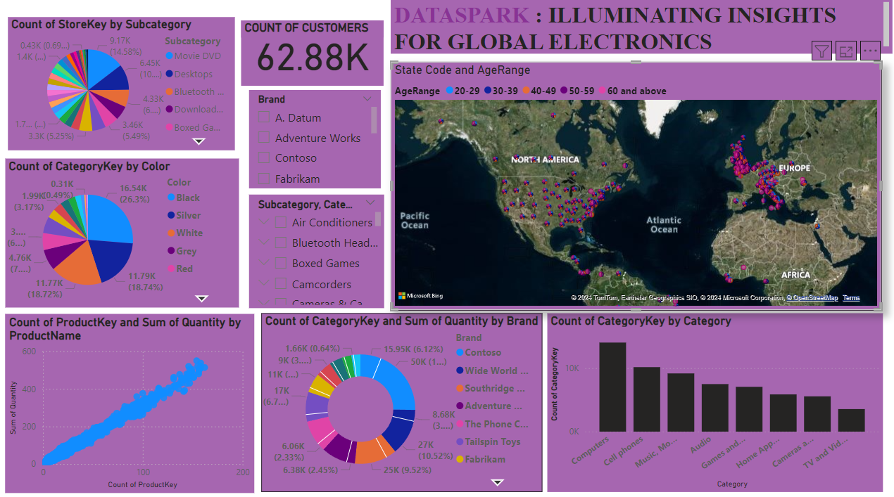

# DataSpark-Illuminating-Insights-for-Global-Electronics

# Project overview 
   **DataSpark**: Illuminating Insights for Global Electronics is a retail analytics project focused on the electronics industry. The aim is to conduct a comprehensive Exploratory Data Analysis (EDA) to uncover valuable insights from Global Electronics' data and provide actionable recommendations to enhance customer satisfaction, optimize operations, and drive business growth.
   
 # Problem Statement
As part of Global Electronics' data analytics team, the goal is to analyze data from customers, products, sales, stores, 
and currency exchange rates to identify key insights that will enhance marketing strategies, optimize inventory management, 
improve sales forecasting, and drive overall business growth.

# Tools and Technologies 
Before you begin, ensure you have the following installed:
**Python** : For data cleaning, preparation, and statistical analysis (using libraries like Pandas, NumPy, Matplotlib, Seaborn).
**SQL** : For data management and querying.
**Power BI/Tableau** : For creating interactive dashboards and visualizations.

# Approach 
**Data Cleaning and Preparation**:
--->Check for missing values and handle them appropriately
--->Convert data types where necessary (e.g., dates, numerical values).
--->Merge datasets where necessary for analysis (e.g., linking sales data with product and customer data).
**Load Data**:
Insert the preprocessed data into an SQL database by creating relevant tables for each data source and using SQL INSERT statements to load the data.
**Power BI Visualization**:
Connect SQL to Power BI/Tableau, import the data, and create interactive dashboards.
**Develop 10 SQL Queries**:
Formulate and execute 10 SQL queries to extract key insights from the data. These queries should address important business questions and support the analysis steps below.

# Exploratory Data Analysis (EDA) 
Exploratory Data Analysis (EDA) is a crucial initial step in data science projects. It involves analyzing and visualizing data to understand
its key characteristics, uncover patterns, and identify relationships between variables refers to the method of
studying and exploring record sets to apprehend their predominant traits, discover patterns, locate outliers, 
and identify relationships between variables. EDA is normally carried out as a preliminary step before undertaking extra formal statistical analyses or modeling.

# Strategic Use Cases
**Marketing Optimization**: Fine-tune marketing strategies by aligning with customer demographics and purchasing behaviors.
**Inventory Management**: Improve inventory planning based on data-driven insights into product popularity.
**Sales Forecasting**: Enhance sales predictions through trend analysis and historical data.
**Operational Excellence**: Inform store expansion and optimization decisions with precise performance metrics.
**Pricing Strategy**: Optimize international pricing by understanding the interplay between currency exchange rates and sales performance.

# conclusion:
Upon completion of the project, learners are expected to deliver a comprehensive Exploratory Data Analysis (EDA) report for Global Electronics, 
featuring clean and integrated datasets, in-depth insights into customer demographics, purchasing behaviors, product performance, store operations, 
and currency impact on sales. The report will include visually compelling visualizations and actionable recommendations tailored to enhance 
marketing strategies, optimize inventory management, improve sales forecasting, guide product development, and inform store expansion and operational decisions.
This analysis will empower Global Electronics to increase customer satisfaction, maximize revenue, and drive overall business growth.

# References
[Python Documentation](https://docs.python.org/3/)
[SQL Documentation](https://dev.mysql.com/doc/)
[PowerBi Documentation](https://learn.microsoft.com/en-us/power-bi/)
[EDA Documentation](https://python-data-science.readthedocs.io/en/latest/exploratory.html)

